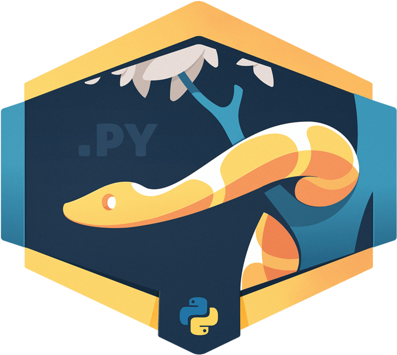

# Python Study Note - curieuxjy
#### (前)AI Robotics KR - Python Basic 스터디 Repository → [HERE](./README_2019.md)
</img>

## 스터디 소개:
- 목적: Google Colab 환경에서 Python Skill UP!
- 자료 책임 및 update: 이정연 (email) curieuxjy@gmail.com

## Study Repository 사용법:
- Python 기초와 입문을 막 지난 후, 각자의 프로젝트를 진행하면서 조금 미흡한 부분을 채워줄 중고급 실력을 기릅니다.
- (2020.02.13) 현재 스터디 자료로 보고 있는 책: "파이썬 코딩의 기술(브렛 슬라킨 지음, 김형철 옮김, 길벗(2016))"

  
  
- [.ipynb 파일을 colab 환경에서 실행하는 방법](https://github.com/curieuxjy/python_study/blob/master/how_to_google_colab.md)을 정리해두었습니다. Thanks to @changh95

## 스터디 자료
| Contents       | Code|
|--------------|---------|
|chapter1_BW1~|[Code](./Effective_python/chapter_1.ipynb)|
| |[Code]()|
| |[Code]()|
| |[Code]()|
| |[Code]()|

### Notice
- 본인도 공부하면서 자료를 정리하고 있고 현재 특별히 정해진 스터디 형태가 없으니, 편하게 각자 repository를 download 하셔서 python 공부하시면 됩니다.
- [python 자료 참고](https://winterj.me/python-books-for-intermediate/?fbclid=IwAR3NBsUDFNWQ_qNXbAnfm-rQBmdj7dWgt9gBab7DLOG5l4XtNCqbmSss6PY)
- 문의가 있으실 경우, curieuxjy@gmail.com 으로 이메일 주시면 감사하겠습니다.

